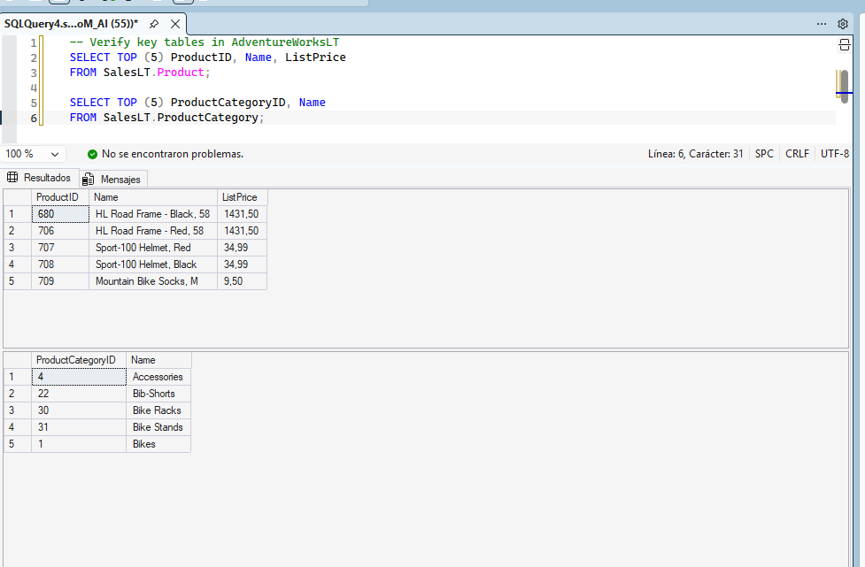
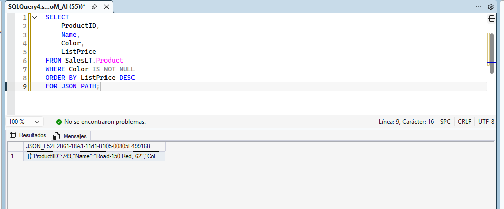
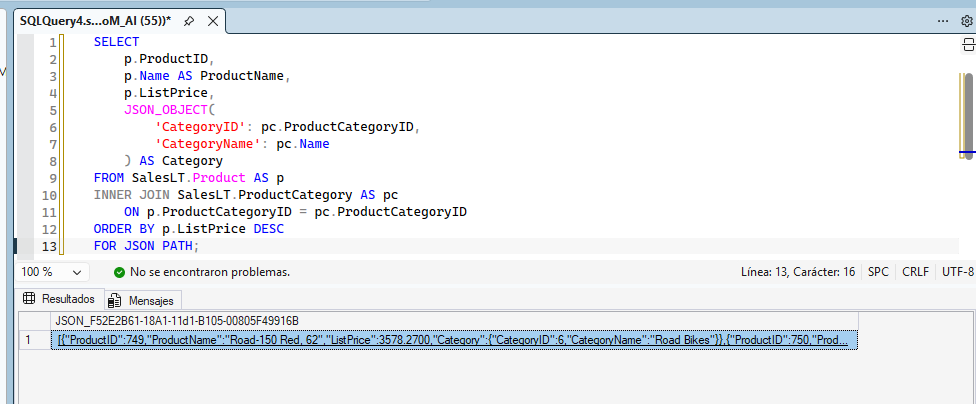
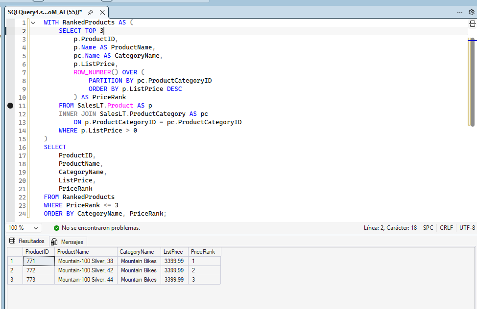
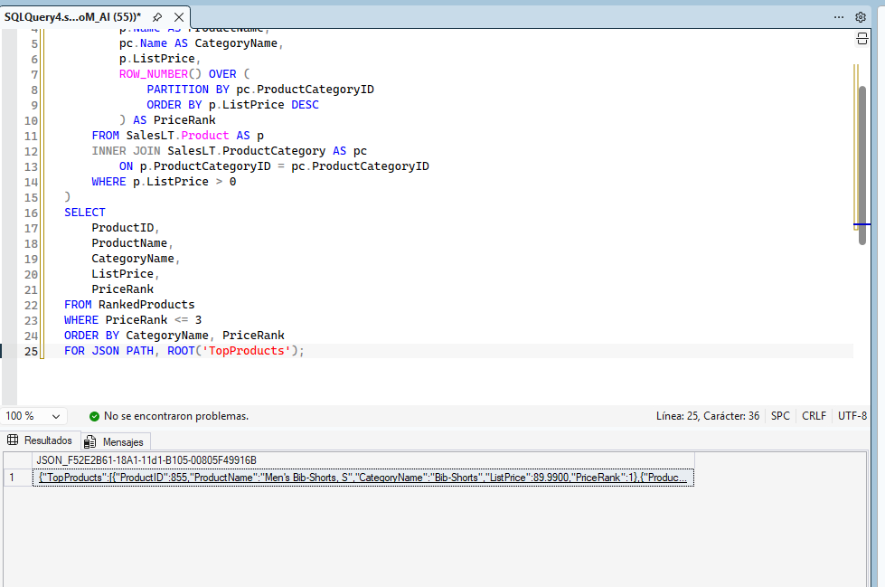
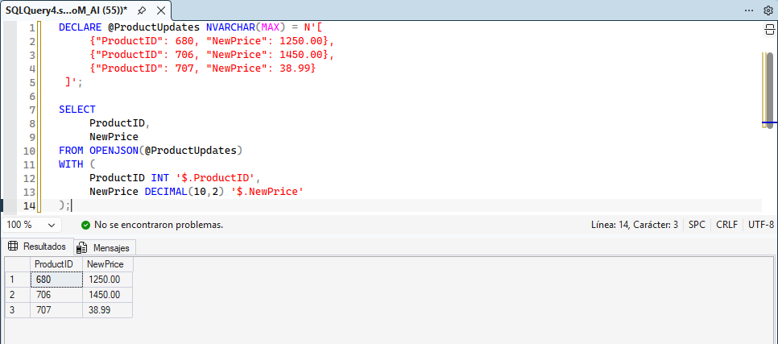
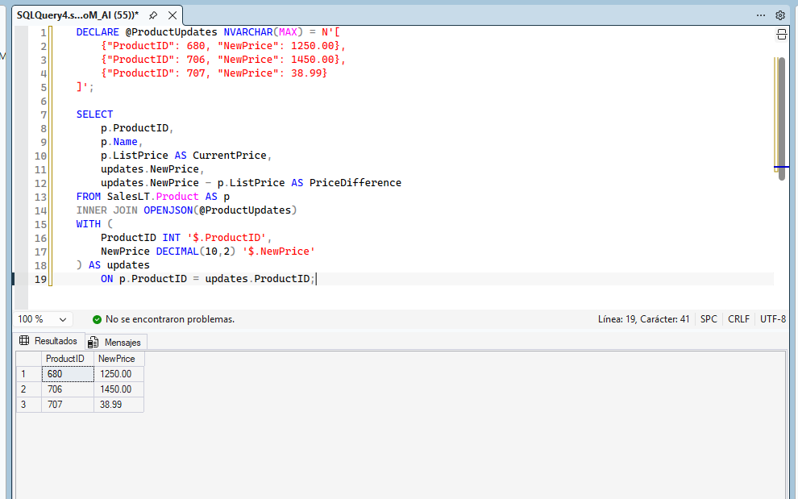

# dq800-lab3-tsql-avanzado

# Informe de Práctica — Lab: Write advanced T-SQL queries (DQ-800)

**Módulo:** DP-800
**Práctica:** Write advanced T-SQL queries (JSON, CTE, funciones de ventana, OPENJSON)
**Base de datos:** AdventureWorksLT
**Fuente del enunciado:** [Microsoft Learn — Write advanced T-SQL queries](https://microsoftlearning.github.io/mslearn-sql-developer/Instructions/Labs/03-write-advanced-tsql-code.html)

## 1. Introducción

> **En el laboratorio 3 de la DP-800 se van a generar de productos en formato JSON para un catalogo web y crear informes que rankearan productos dentro de cada categoría**
> 

### 1.1 Objetivos

- Generar salida JSON a partir de datos de productos con `FOR JSON PATH`.
- Crear estructuras JSON anidadas con `JSON_OBJECT`.
- Combinar salida JSON con una CTE y una función de ventana (`ROW_NUMBER()`).
- Parsear datos JSON con `OPENJSON` y unirlos con tablas existentes.

### 1.2 Prerrequisitos

- SQL Server 2022+ o Azure SQL Database.
- Herramienta de consultas (por ejemplo, SQL Server Management Studio).
- Conexión con permisos de lectura.
- Base de datos de ejemplo [AdventureWorksLT](https://learn.microsoft.com/en-us/sql/samples/adventureworks-install-configure).

## 2. Conexión a AdventureWorksLT

Verificación de la conectividad con la base de datos y de la existencia de las tablas clave.

```sql
-- Verify key tables in AdventureWorksLT
SELECT TOP (5) ProductID, Name, ListPrice
FROM SalesLT.Product;

SELECT TOP (5) ProductCategoryID, Name
FROM SalesLT.ProductCategory;
```

> 
> 
> 
> 
> 

## 3. Construcción de salida JSON a partir de datos de productos

### 3.1 Crear un objeto JSON por producto

Uso de `FOR JSON PATH` para convertir filas de productos en JSON.

```sql
SELECT
    ProductID,
    Name,
    Color,
    ListPrice
FROM SalesLT.Product
WHERE Color IS NOT NULL
ORDER BY ListPrice DESC
FOR JSON PATH;
```

> **La clausula `FOR JSON PATH` se encarga de convertir en arrays json que corresponden las filas a las columnas**
> 

> 
> 
> 
> 
> 

### 3.2 Crear JSON anidado con categorías de producto

Se añade información de categoría como un objeto anidado mediante `JSON_OBJECT`.

```sql
SELECT
    p.ProductID,
    p.Name AS ProductName,
    p.ListPrice,
    JSON_OBJECT(
        'CategoryID': pc.ProductCategoryID,
        'CategoryName': pc.Name
    ) AS Category
FROM SalesLT.Product AS p
INNER JOIN SalesLT.ProductCategory AS pc
    ON p.ProductCategoryID = pc.ProductCategoryID
ORDER BY p.ListPrice DESC
FOR JSON PATH;
```

> **La anidación de JSON nos permite estructurar más el objeto JSON que nos devuelve la transformación de las consulta**
> 

> 
> 
> 
> 
> 

## 4. Combinar JSON con una CTE y una función de ventana

### 4.1 CTE con ranking mediante función de ventana

Construcción de la lógica de la consulta usando una CTE y `ROW_NUMBER()`.

```sql
WITH RankedProducts AS (
    SELECT
        p.ProductID,
        p.Name AS ProductName,
        pc.Name AS CategoryName,
        p.ListPrice,
        ROW_NUMBER() OVER (
            PARTITION BY pc.ProductCategoryID
            ORDER BY p.ListPrice DESC
        ) AS PriceRank
    FROM SalesLT.Product AS p
    INNER JOIN SalesLT.ProductCategory AS pc
        ON p.ProductCategoryID = pc.ProductCategoryID
    WHERE p.ListPrice > 0
)
SELECT
    ProductID,
    ProductName,
    CategoryName,
    ListPrice,
    PriceRank
FROM RankedProducts
WHERE PriceRank <= 3
ORDER BY CategoryName, PriceRank;
```

> El CTE calcula una clasificación de precios para cada producto dentro de su categoría. La cláusula reinicia la numeración de cada categoría y asigna rango 1 al producto más caro. La consulta externa filtra solo los 3 productos principales por categoría.`PARTITION BYORDER BY ListPrice DESC`
> 

> 
> 
> 
> 
> 

### 4.2 Exportar los productos rankeados como JSON

Se añade `FOR JSON PATH` con `ROOT('TopProducts')` para dar formato a los resultados como si fueran para una API.

```sql
WITH RankedProducts AS (
    SELECT
        p.ProductID,
        p.Name AS ProductName,
        pc.Name AS CategoryName,
        p.ListPrice,
        ROW_NUMBER() OVER (
            PARTITION BY pc.ProductCategoryID
            ORDER BY p.ListPrice DESC
        ) AS PriceRank
    FROM SalesLT.Product AS p
    INNER JOIN SalesLT.ProductCategory AS pc
        ON p.ProductCategoryID = pc.ProductCategoryID
    WHERE p.ListPrice > 0
)
SELECT
    ProductID,
    ProductName,
    CategoryName,
    ListPrice,
    PriceRank
FROM RankedProducts
WHERE PriceRank <= 3
ORDER BY CategoryName, PriceRank
FOR JSON PATH, ROOT('TopProducts');
```

> 
> 
> 
> 
> 

## 5. Parsear datos JSON con OPENJSON

### 5.1 Parsear un array JSON en filas

Uso de `OPENJSON` para convertir una cadena JSON de actualizaciones de productos en una tabla.

```sql
DECLARE @ProductUpdates NVARCHAR(MAX) = N'[
     {"ProductID": 680, "NewPrice": 1250.00},
     {"ProductID": 706, "NewPrice": 1450.00},
     {"ProductID": 707, "NewPrice": 38.99}
 ]';

SELECT
     ProductID,
     NewPrice
FROM OPENJSON(@ProductUpdates)
WITH (
     ProductID INT '$.ProductID',
     NewPrice DECIMAL(10,2) '$.NewPrice'
);
```


> 
> 
> 
> 
> 

### 5.2 Unir el JSON parseado con datos existentes

Combinación de los datos JSON parseados con la tabla `Product` para comparar precio actual y precio nuevo.

```sql
DECLARE @ProductUpdates NVARCHAR(MAX) = N'[
     {"ProductID": 680, "NewPrice": 1250.00},
     {"ProductID": 706, "NewPrice": 1450.00},
     {"ProductID": 707, "NewPrice": 38.99}
 ]';

SELECT
     p.ProductID,
     p.Name,
     p.ListPrice AS CurrentPrice,
     updates.NewPrice,
     updates.NewPrice - p.ListPrice AS PriceDifference
FROM SalesLT.Product AS p
INNER JOIN OPENJSON(@ProductUpdates)
WITH (
     ProductID INT '$.ProductID',
     NewPrice DECIMAL(10,2) '$.NewPrice'
) AS updates
     ON p.ProductID = updates.ProductID;
```

> 
> 
> 
> 
> 

## 6. Limpieza de recursos

No se eliminan los recursos

## 7. Conclusiones

> **Todas las funciones para trabajar con JSON muy útiles para la exportación de los datos a aplicaciones o apis que trabajen con tu base de datos**
>
